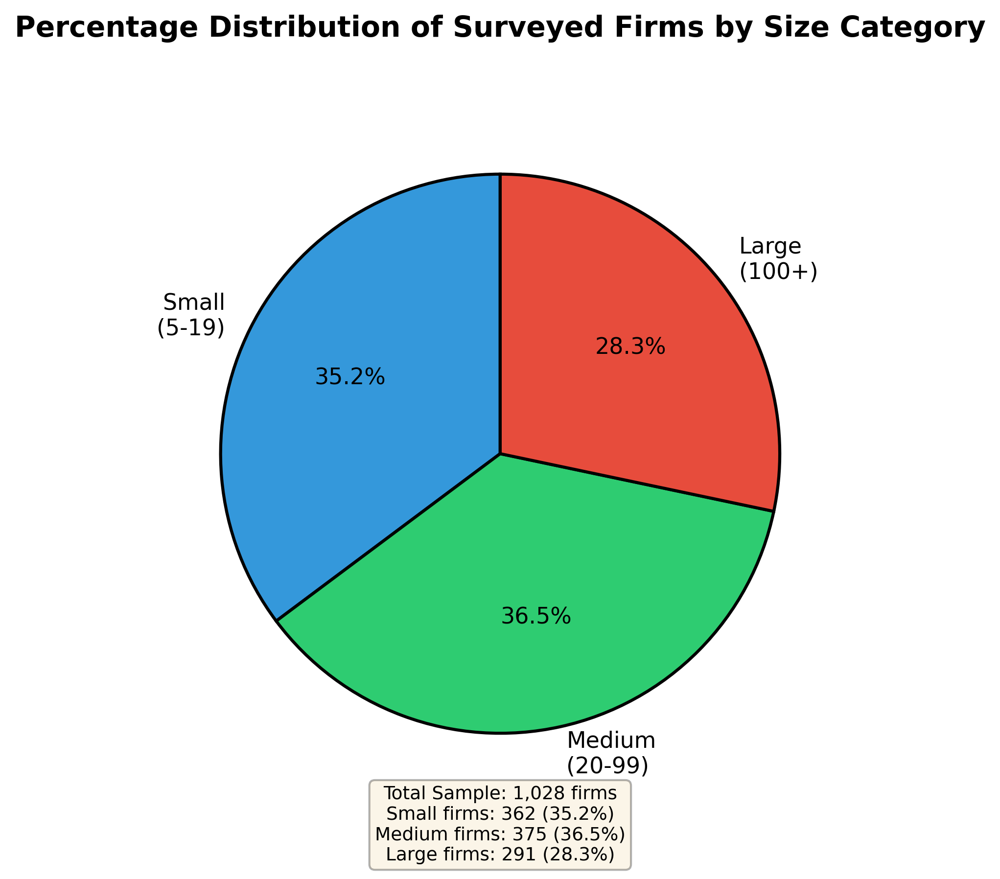
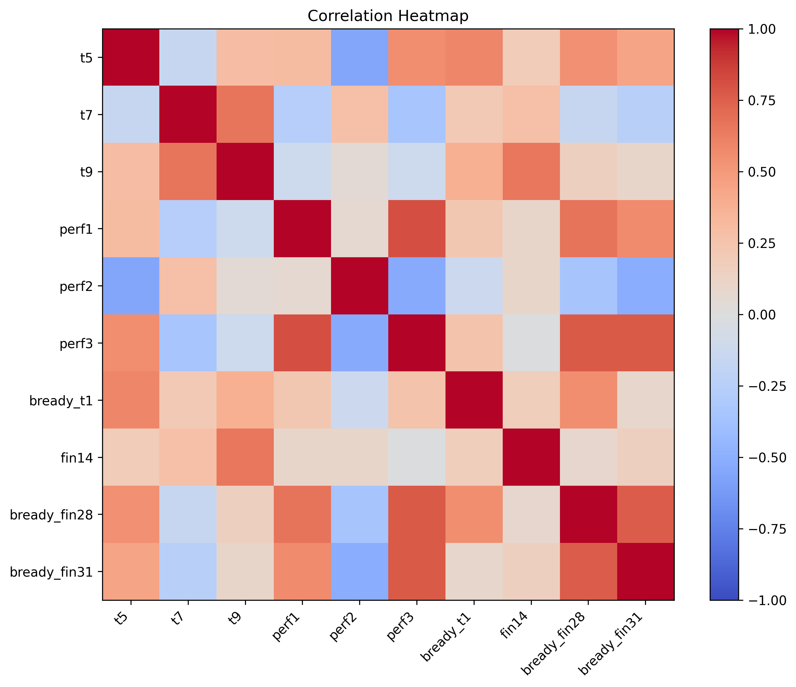

# WBES_INCOTEH_2026

### Digital Technology Adoption and Innovation Performance in Vietnamese Enterprises: Evidence From the 2023 Enterprise Survey


- ❤️Our project page: XXX
- ❤️Paper: XXX

**[2025/XX/XX: Good News!]**     

* Our paper XXX.

## Updates
- **[2024/XX/XX: Source code is released!]** 
    * The first version of source code has been initialized.

---

### Data analysis for the paper

- Full data with indicator explaination: https://datacatalog.worldbank.org/search/dataset/0037947/enterprise-surveys
- Download the "STATA file", and put it into the "data" directory.

## 1. Enviroment installation
These packages are used with python = 3.8.

```bash
numpy = 1.21.6
pandas = 1.3.5
Pillow = 9.5.0
scikit-image = 0.19.3
scikit-learn = 1.0.2
scipy = 1.7.3
seaborn = 0.12.2
```

## 2. Analysis Pipeline


### Stage 1: Data Preparation and Cleaning

- Extract Vietnam data from the World Bank Enterprise Survey
- Convert data from Stata (dta) to CSV format
- Filter records to Vietnam enterprises in 2023 only
- Convert missing values (‘.’) to null
- Convert numeric fields from string to numeric format and remove missing values (NAN)

<b>Run this command to get the "vietnam_data_clean.csv": </b>

```bash
$ python prepare_data.py
```

<b>Run this command to get the overview of the data: </b>

```bash
$ python get_data_overview.py
```


### Stage 2: Group-Level Metric Extraction
- Define firm groups using survey categories
- Segment firms by firm characteristics
- Apply multiple criteria to filter groups
- Extract group-level metrics
- Select four innovation indicators
- Extract indicators across all firm size categories


### Stage 3: Correlation Analysis Across Enterprise Segments

- Use subgroup-level data for analysis
- Collect 23 enterprise segments across all category types
- Structure data as 23 rows × 10 indicators
- Apply Pearson correlation across segments
- Generate full correlation matrix

```bash
$ python analyze_data.py
$ python cal_correlation_significance.py
```



### Stage 4: Statistical Validation
- Use standard errors and sample sizes
- Compute standard errors for proportions
- Treat 23 segments as observations
- Test correlation significance
- Convert correlations to t-statistics
- Apply two-tailed test at 5% level

<b>Two-tailed test was also implemented in the "cal_correlation_significance.py" file (We can skip the following script): </b>

```bash
$ python cal_correlation_significance.py
```

## Citations
Please cite our paper if you find it useful
```
@article{,
}